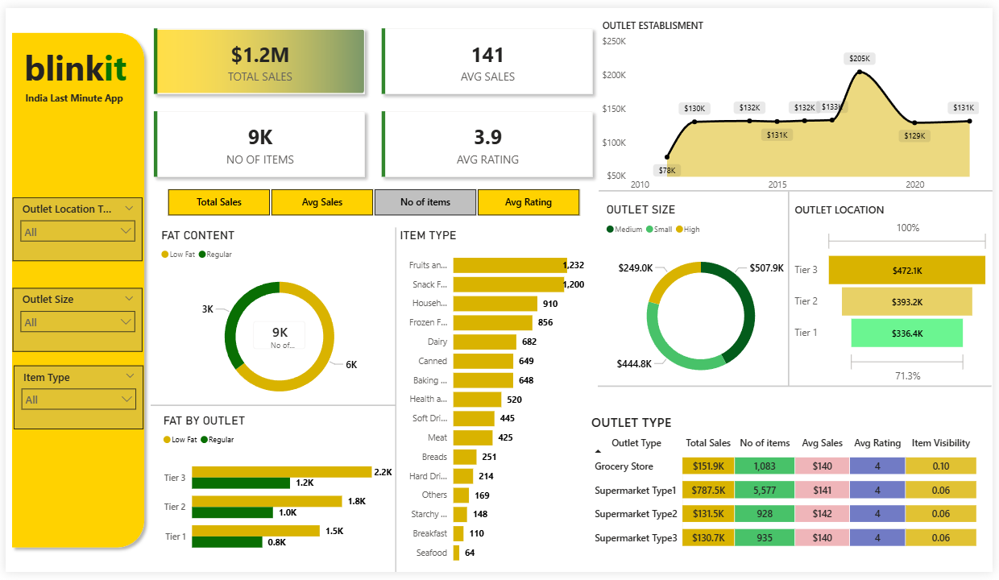

# 🛒 Blinkit Sales Intelligence Dashboard (Power BI)

## 📌 Problem Statement

Blinkit operates across multiple outlet sizes, locations, and product categories.
The objective of this project is to analyze sales performance and identify key business drivers to improve revenue, product strategy, and outlet efficiency.

---

## 📊 Key Metrics

* 💰 Total Sales: $1.2M
* 📦 Total Items Sold: 9,000
* ⭐ Average Rating: 3.9
* 📈 Average Sales per Item: $141

---

## 🧠 Business Insights (Critical Findings)

### 1. Outlet Performance

* Tier 3 outlets generate the **highest revenue (~$472K)**
* Tier 1 outlets lag behind (~$336K)
  👉 Insight: Lower-tier cities are stronger revenue drivers → expansion opportunity

---

### 2. Product Category Analysis

* Top categories:

  * Fruits & Vegetables (~1232 items)
  * Snack Foods (~1200 items)
* Low-performing:

  * Seafood, Breakfast, Starchy foods
    👉 Insight: Demand is heavily skewed toward daily-consumption items

---

### 3. Outlet Type Contribution

* Supermarket Type1 dominates (~$787K sales)
* Grocery stores contribute significantly less (~$151K)
  👉 Insight: Larger retail formats outperform small stores in revenue generation

---

### 4. Fat Content Trends

* Regular fat products dominate sales (~6K items vs 3K low-fat)
  👉 Insight: Customers prioritize taste over health → opportunity for premium healthy positioning

---

### 5. Outlet Size Impact

* Medium-size outlets generate highest revenue (~$507K)
* High-size outlets underperform relative to expectation
  👉 Insight: Optimal store size exists → scaling blindly may reduce efficiency

---

### 6. Time-Based Trends

* Peak sales observed around 2018 (~$205K)
* Slight decline afterward, followed by stabilization
  👉 Insight: Possible market saturation or competition increase

---

## 📈 Dashboard Features

* KPI Cards for quick business overview
* Time-series sales analysis
* Category-wise product performance
* Outlet segmentation (Size, Type, Location)
* Customer preference analysis (Fat Content)

---

## 🛠 Tech Stack

* Power BI (Visualization & Dashboarding)
* DAX (Calculated Measures & KPIs)
* Data Cleaning & Transformation

---

## 📂 Repository Structure

* dashboard.pbix → Power BI file
* data.csv → dataset
* dashboard.png → dashboard preview
* README.md → project documentation

---

## 📸 Dashboard Preview

---

## 🎯 Business Recommendations

* Expand aggressively in Tier 3 cities
* Focus inventory on high-demand categories (Fruits, Snacks)
* Improve performance of large outlets (cost optimization)
* Introduce premium low-fat product marketing
* Invest in Supermarket Type1 expansion

---

## 💡 Key Learnings

* Translating raw data into business decisions
* Designing KPI-driven dashboards
* Identifying hidden trends across multiple dimensions
* Data storytelling for stakeholders

---

## 👨‍💻 Author

Jayant Singh Khanna
Aspiring Data Analyst | Power BI | SQL | Python
